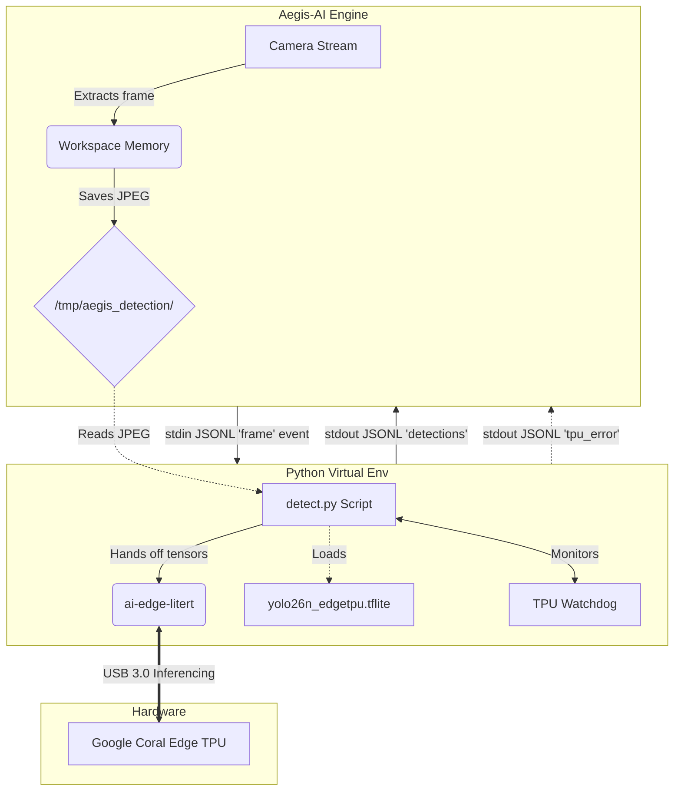

# YOLO 2026 Coral TPU — Real-Time Object Detection

This DeepCamera skill executes real-time object detection natively utilizing the Google Coral Edge TPU USB Accelerator. By executing localized inference on tensor processing hardware, it provides exceptional detection speeds (upwards of ~4ms on 320x320 models) while maintaining complete privacy and functioning entirely offline without relying on cloud providers.

## Architecture & Data Flow

When executing inside Aegis-AI, this skill is deployed as an entirely isolated local process. 

### Flow Breakdown

1. **Deployment Phase**: 
   The OS-specific deployment scripts (`deploy-linux.sh`, `deploy-macos.sh`, `deploy.bat`) provision essential C-libraries (`libusb`), native Google driver binaries (`libedgetpu`), and create an isolated `python3 -m venv` sandbox securely.
   * **Dynamic Models:** Instead of tracking massive raw binary files in git, the deployment script dynamically downloads the `.tflite` compiled models directly from Google's master Edge TPU repository using `curl` / `Invoke-WebRequest`.
2. **Inference Loop**:
   - The host system (Aegis-AI) continuously records frames and saves a snapshot to `/tmp/aegis_detection/` memory cache.
   - Using standard input (`stdin`), Aegis-AI sends a brief JSON control sequence instructing the Python watcher script (`detect.py`) to process the frame.
   - The Edge TPU fetches the tensor, performs native hardware execution using `libusb`, and instantly evaluates bounding box predictions without triggering CPU payload spikes.
   - Results are streamed synchronously over standard output (`stdout`) to Aegis-AI.

## Resilience & Auto-Recovery

The integration features a native **TPU Health Watchdog** built directly into `detect.py`:
* **Hang Detection**: If the USB connection fails and the `ai-edge-litert` delegate locks up, the invocation thread will hard-timeout after 10 seconds. The skill emits a `invoke_timeout` error and exits, prompting Aegis-AI to autonomously restart the sidecar process.
* **Stall Detection**: If the TPU thermally throttles and begins silently returning zero objects for 30 consecutive frames (despite functioning perfectly seconds prior), the watchdog emits a `stall` telemetry event back to Aegis-AI.

## Platform Differences

* **Linux**: Inherits Python dependencies securely and provisions Google's `libedgetpu1-max` driver via `apt-get` on Debian/Ubuntu systems. Uses `ai-edge-litert` to support modern Python (3.9 - 3.13) without requiring legacy `pycoral` or `pyenv` locking.
* **macOS**: Fully supports Apple Silicon natively. Uses the `feranick/libedgetpu` community fork to allow Edge TPU execution on ARM64 chips without relying on Rosetta 2.
* **Windows**: Relies on PowerShell bootstrapping and transparent UAC elevation logs to quietly execute Google's `install.bat`. Fallbacks to community wheels gracefully.

## Configuration Options

Configure these inside the Aegis-AI UI:
* **Input Resolution:** `320` is highly recommended. It perfectly fits into the Edge TPU's internal SRAM cache and executes fully on the co-processor. Scaling up to `640` pushes memory limits and offloads chunks to the host CPU, slowing things significantly.
* **FPS:** Caps execution speeds to prevent thermal starvation and USB saturation on shared bus systems.
* **Clock Speed:** Standard is safe. Max draws more power and produces thermal heat; it should only be used if there is a heatsink fan actively installed on the TPU.
